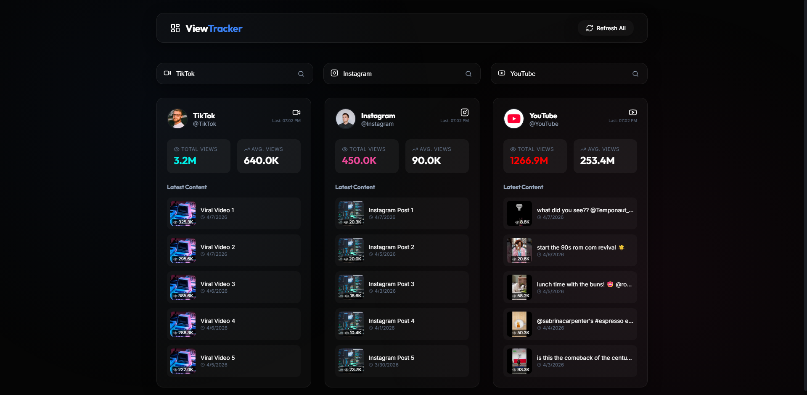

<p align="center">
  
</p>

<h1 align="center">ViewTracker</h1>

<p align="center">
  <strong>Cross-platform social media analytics dashboard for real-time view tracking</strong>
</p>

<p align="center">
  <a href="#features">Features</a> •
  <a href="#quick-start">Quick Start</a> •
  <a href="#tech-stack">Tech Stack</a> •
  <a href="#project-structure">Project Structure</a> •
  <a href="#license">License</a>
</p>

<p align="center">
  
  
  
  
</p>

---

A sleek, responsive web application built to monitor and display social media views from multiple platforms in a single unified dashboard without needing to reload the page.

## Features

### 📱 Multi-Platform Tracking
Monitor metrics across **YouTube**, **TikTok**, and **Instagram** simultaneously. Input usernames or channels and fetch real-time engagement data on a single screen.

### ⚡ Dynamic AJAX Refresh
Seamless data updates. Refresh all platforms at once or individually without ever reloading the browser page. Persistent loading states keep the experience smooth.

### 🎨 Premium Dark Mode UI
Built with a beautiful **Glassmorphism** design aesthetic inspired by modern SaaS dashboards, featuring micro-animations powered by Framer Motion.

### 📊 Holistic Analytics View
- **Total Views** — Combined metrics for overall account reach
- **Average Views** — Quick math calculating average engagement per recent post
- **Latest Content** — Displays thumbnails, view counts, and published dates for the 5 most recent posts on each platform

## Quick Start

### Prerequisites
- Node.js 18+

### 1. Clone and Configure

```bash
git clone https://github.com/kevinariel1/Cross-Platform-Analytics.git
cd Cross-Platform-Analytics
```

Ensure you configure your environment variables. Create a `.env.local` file:
```env
NEXT_PUBLIC_YOUTUBE_API_KEY=your_youtube_api_key_here
```
*(Note: TikTok and Instagram use built-in intelligent mock data fallbacks to maintain compliance with commercial API limits).*

### 2. Install and Run

```bash
npm install
npm run dev
```

The app will be available at `http://localhost:3000`

## Tech Stack

| Layer | Technology |
|-------|------------|
| **Framework** | Next.js 15 (App Router) |
| **UI** | React 19, CSS (Glassmorphism) |
| **Language** | TypeScript 5 |
| **Icons** | Lucide React |
| **Animations** | Framer Motion |

## Project Structure

```text
cross-platform-view-tracker/
├── src/
│   ├── app/           # Next.js App Router & API proxy routes
│   ├── components/    # Reusable UI components (Dashboard, PlatformCard)
│   ├── services/      # Unified API Interface (socialApi.ts)
│   └── types/         # TypeScript interfaces
├── public/            # Static assets
└── SUBMISSION.md      # Additional technical details & approaches
```

## Setup & Fallback System

Due to API constraints on TikTok and Instagram (which require manual approval and are heavily restricted for commercial usage), this project utilizes a **Unified API Interface** (`src/services/socialApi.ts`). While YouTube fetches directly using the v3 Data API, TikTok and Instagram gracefully fallback to beautifully structured local mock data simulating a real API response, ensuring a resilient and complete UI demonstration at all times.

## License

This project is open-source and available under the MIT License.
